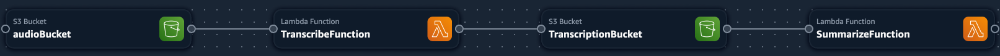

# Create a Serverless Pipeline to Ingest Amazon Connect Audio

The objective of this stack is to deploy Serverless Components in order to trigger Lambda functions to transcribe and summarize audio calls from Amazon Connect solution!

## Simple Deployment

1. Install AWS SAM CLI. [Deploy with AWS SAM](https://docs.aws.amazon.com/serverless-application-model/latest/developerguide/what-is-sam.html)
2. Navigate to the `cfn` directory.
3. Run `sam build`.
4. To deploy the component on your AWS Account, run `sam deploy --guided`.
5. Wait for your stack to be deployed successfully.
6. Use AWS CLI to push objects to an AWS bucket.
7. Retrieve the result.

## Only If Your are a Data Scientists ( Depoy through Jupyter Notebook )

1. Create two buckets:
    - One bucket to store your .wav files.
    - Another bucket to receive the conversation transcript and summary of the call.
2. Create your Lambda layer using the "dlai-bedrock-jinja-layer.zip" file. Refer to [AWS documentation](https://docs.aws.amazon.com/lambda/latest/dg/creating-deleting-layers.html).
3. Update the Jupyter Notebook accordingly.

Update your OS variables (`GenerateAmazonConnectCallSummary.ipynb`):
- `os.environ['LEARNERS3BUCKETNAMETEXT']`
- `os.environ['LAMBDALAYERVERSIONARN']`
- `os.environ['LEARNERS3BUCKETNAMEAUDIO']`

### Create a Jupyter Notebook Environment
- [Amazon SageMaker Studio Classic](https://docs.aws.amazon.com/sagemaker/latest/dg/notebooks.html)

### Create a Dialog with Your Amazon Connect Instance
- Copy the dialog with the name 'dialog.wav'.

### You're Ready, Run it!
Run your notebook. The result will be in the `Result.txt` file inside your `LEARNERS3BUCKETNAMEAUDIO` bucket.

### Customization
Update your template file instructions to customize the result content.

### Integration with Amazon Connect Contact Lens
- Enable Amazon Connect Contact Lens. Refer to [AWS documentation](https://docs.aws.amazon.com/connect/latest/adminguide/enable-analytics.html).
- Use Amazon S3 trigger to invoke your Lambda function. Refer to [AWS documentation](https://docs.aws.amazon.com/lambda/latest/dg/with-s3-example.html). Update your Jupyter Notebook accordingly.
